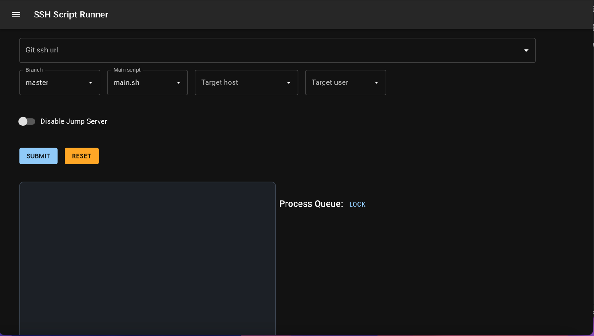
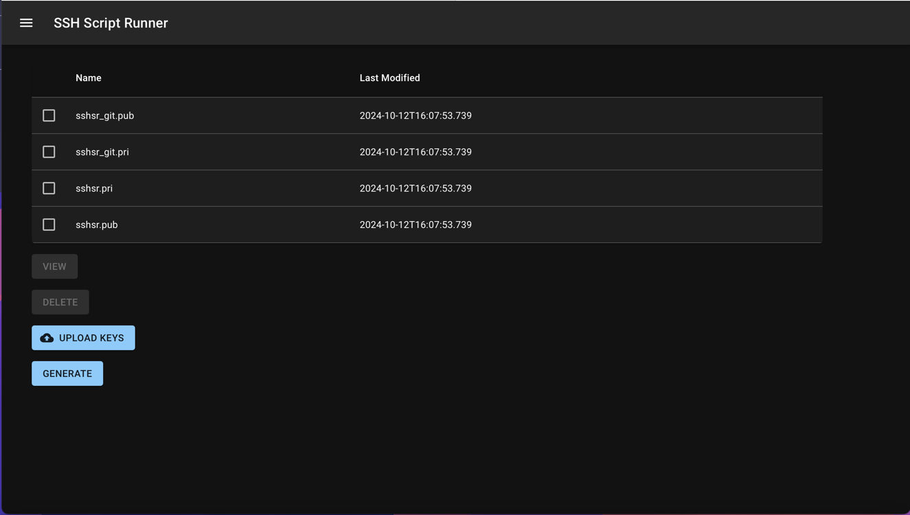

# SSH Script Runner
> connect to remote server to run script via SSH triggered by REST API
## Technical Stack
- jdk 21
- maven
- vert.x
- apache sshd
- HOCON configuration
- React
- MUI
- Vite
- Typescript
- Server Side Event
- SSH
## Install
```shell
bash <(curl https://raw.githubusercontent.com/pangzixiang/ssh-script-runner/refs/heads/main/bin/install.sh)
```

## Features

- Run the shell script which is under the .sshsr folder in your repository in remote server(support jump server)
  
- maintain(view, upload & download) the SSH key for git or server ssh connection, even supporting generate the ssh key
  pair so that you can import into the target servers.
  